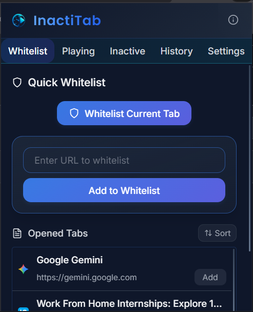
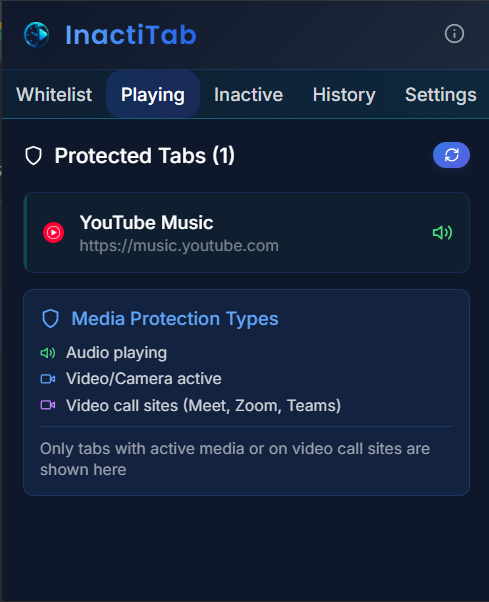
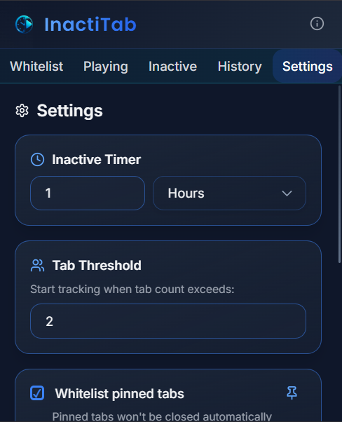
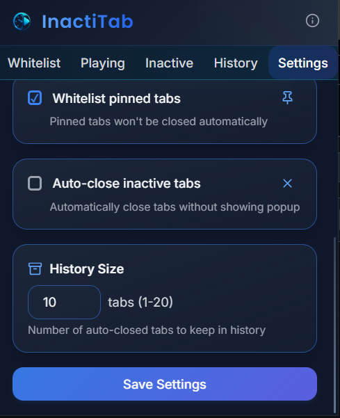

# 💤 InactiTab - Smart Tab Management Extension

  
  
  
  
  
  

---

## 📖 Overview

**InactiTab** is an intelligent Chrome extension designed to help users manage their browser tabs efficiently by automatically tracking inactive tabs and providing powerful management tools. The extension detects tab activity, monitor resource usage, and offer bulk management capabilities while protecting important tabs from accidental closure.

### 🎯 What It Does

- **Automatic Tab Tracking**: Monitors tab activity and marks inactive tabs with sleep indicators (💤)
- **Smart Protection System**: Automatically protects tabs with media playback, video calls, and whitelisted sites
- **Resource Monitoring**: Real-time CPU and memory usage tracking for each tab
- **Bulk Management**: Select and manage multiple inactive tabs simultaneously
- **Customizable Settings**: Flexible timer settings and behavior customization
- **Auto-close History**: Track and restore previously auto-closed tabs

---

## 📱 UI Screenshots

  <!-- Whitelist Management -->
  

    <h3>Whitelist Management</h3>
    
  

  <!-- Playing Tab Monitoring -->
  

    <h3>Playing Tab Monitoring</h3>
    
  

---

  <h3>Settings Panel</h3>

  

    
  

  

    
  

---

## ✨ Key Features

### 🛡️ Smart Tab Protection

- **Auto-Protection**: Automatically protects tabs with:
  - 🎵 Audio/Video playback
  - 📹 Active video calls (Meet, Zoom, Teams, Discord)
  - 📌 Pinned tabs (when enabled)
  - 🔒 Whitelisted domains
- **Manual Protection**: Add any website to the whitelist for permanent protection

### 💤 Intelligent Inactivity Detection

- **Visual Indicators**: Sleep emoji (💤) appears on inactive tab titles
- **Customizable Timers**: Set inactivity timeout from seconds to hours
- **Real-time Monitoring**: Tracks mouse movement, keyboard input, and scroll events
- **Smart Reset**: Activity automatically resets the inactivity timer

### 📊 Resource Monitoring

- **CPU Usage Tracking**: Real-time CPU usage monitoring for each tab
- **Color-coded Indicators**:
  - 🟢 Green: < 2% CPU usage
  - 🟡 Yellow: 2-5% CPU usage
  - 🔴 Red: > 5% CPU usage
- **Memory Statistics**: Track tab memory consumption
- **Performance Insights**: Identify resource-heavy tabs

### 🔄 Bulk Tab Management

- **Multi-select Interface**: Select multiple tabs for batch operations
- **Sort Options**: Sort tabs by CPU usage, title, or protection status
- **Bulk Actions**: Close, whitelist, or manage multiple tabs at once
- **Smart Filtering**: Filter tabs by activity status

### 📚 Auto-close History

- **Restoration System**: Restore accidentally closed tabs
- **History Tracking**: Keep track of auto-closed tabs with timestamps
- **Bulk Restore**: Restore multiple tabs simultaneously
- **Configurable Limits**: Set maximum history retention

### ⚙️ Advanced Settings

- **Timer Configuration**: Customize inactivity detection timeouts
- **Threshold Settings**: Set CPU usage thresholds for warnings
- **Auto-close Mode**: Enable/disable automatic tab closure
- **History Management**: Configure history retention limits
- **Theme Options**: Light and dark theme support

---

## 🛠️ Techstack

### Frontend

- **React 18.2.0** - Modern UI library with hooks
- **Tailwind CSS 3.3.5** - Utility-first CSS framework
- **Lucide React** - Beautiful icon library

### Build Tools

- **Vite 7.1.1** - Fast build tool and development server
- **PostCSS** - CSS processing with autoprefixer
- **ESLint** - Code linting and quality assurance

### Browser APIs

- **Chrome Extensions API** - Manifest V3 service worker
- **Tabs API** - Tab management and monitoring
- **Storage API** - Settings and data persistence
- **Scripting API** - Content script injection
- **Notifications API** - User notifications

### Development Tools

- **ES Modules** - Modern JavaScript module system
- **React Hooks** - Custom hooks for state management
- **Chrome DevTools** - Extension debugging and profiling

### Architecture

- **React Popup Interface** - Modern, responsive UI
- **Modular Component System** - Reusable UI components
- **Custom Hook Pattern** - Centralized state management

---

## 🚀 Why InactiTab?

### 💻 **Performance Optimization**

Traditional tab management often relies on manual intervention. InactiTab automates the process with intelligent algorithms that:

- Monitor real-time CPU and memory usage
- Automatically detect tab activity patterns
- Provide granular control over resource consumption
- Prevent browser slowdowns from inactive tabs

### 🧠 **Smart Intelligence**

Unlike basic tab managers, InactiTab uses contextual awareness:

- **Media Detection**: Never closes tabs with active audio/video
- **Call Protection**: Recognizes video conferencing platforms
- **User Patterns**: Learns from user behavior and preferences
- **Domain Intelligence**: Understands website importance through whitelisting

### 🎯 **User-Centric Design**

Built with productivity in mind:

- **Non-Intrusive**: Works silently in the background
- **Reversible Actions**: Full history and restoration capabilities
- **Customizable**: Adapts to individual workflow preferences
- **Visual Feedback**: Clear indicators for all tab states

### 🔒 **Privacy & Security**

- **Local Processing**: All data stays on your device
- **No External Servers**: No data transmission to third parties
- **Minimal Permissions**: Only requests necessary browser permissions
- **Open Source**: Transparent code for security auditing

### ⚡ **Modern Technology**

- **Manifest V3**: Latest Chrome extension standards
- **React Architecture**: Maintainable and scalable codebase
- **ES Modules**: Modern JavaScript for better performance
- **Vite Build System**: Fast development and optimized builds

---

## 🎉 Final Words

InactiTab represents a new generation of browser productivity tools that work intelligently in the background to enhance your browsing experience. Whether you're a power user with hundreds of tabs or someone who wants better control over browser performance, InactiTab provides the tools you need without getting in your way.

### 🌟 **What Makes It Special**

- **Zero Learning Curve**: Works immediately after installation
- **Adaptive Intelligence**: Becomes smarter with usage
- **Performance Impact**: Minimal resource footprint
- **Future-Proof**: Built with modern web standards

## 🚀 Installation

1. **Download the Extension**

   - Clone or download this repository
   - Extract files to a folder

2. **Install in Chrome**

   - Open `chrome://extensions/`
   - Enable "Developer mode"
   - Click "Load unpacked"
   - Select the extension folder

3. **Pin the Extension**
   - Click the puzzle piece icon in Chrome
   - Pin InactiTab for easy access

---

### 🤝 **Community & Support**

- **Open Source**: Contribute to the project on GitHub
- **Bug Reports**: Help us improve by reporting issues
- **Feature Requests**: Suggest new features and improvements
- **Documentation**: Comprehensive guides and API documentation

### 🔮 **Future Roadmap**

- Cross-browser compatibility (Firefox, Edge)
- Advanced analytics and reporting
- Team collaboration features
- Cloud synchronization for settings
- AI-powered tab categorization

---

  <h3>Made with ❤️ for productivity enthusiasts</h3>

